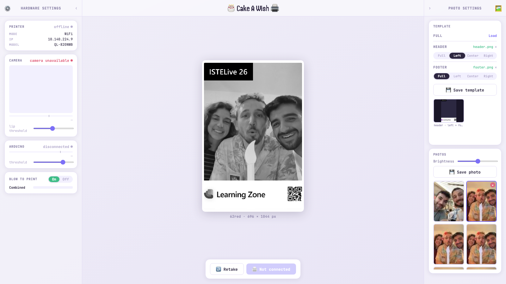
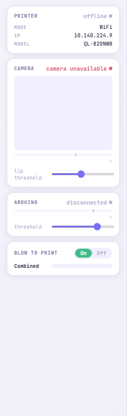
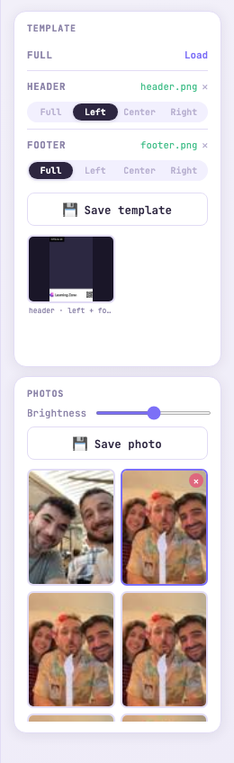

# Cake A Wish

Birthday cake photo-booth kiosk for **Microsoft Learning Zone**. A tablet sits behind a real cake — guests blow on the candle, and the printer inside the cake prints their photo on a label that slides out like a Polaroid.



---

## How it works

```
Tablet (front-facing camera)
        │ WiFi
  FastAPI server  (this repo)
        │ TCP 9100 / HTTP 80
  Brother QL-820NWBc  ←  inside the cake
        │
  DK-22251 label  →  out of the cake
```

Staff run `/admin` on a laptop on the same WiFi. Guests never touch anything — a blow on the candle triggers the print automatically via Arduino mic + MediaPipe face detection.

---

## Pages

| Route | Who | What |
|-------|-----|-------|
| `/admin` | Staff | Full control — camera, capture, template, gallery, settings |
| `/blow/debug` | Staff | Tune blow detection thresholds, simulate blow events |
| `/` | Guests | Kiosk — full-screen live view *(not yet built)* |

---

## Quick start

**Requirements:** Python 3.11+, Brother QL-820NWBc on the network.

```bash
python -m venv .venv
source .venv/bin/activate
pip install -r requirements.txt

# Download the MediaPipe face landmarker model (~3.6MB, not in git)
curl -Lo blow_detection/face_landmarker.task \
  https://storage.googleapis.com/mediapipe-models/face_landmarker/face_landmarker/float16/latest/face_landmarker.task

uvicorn main:app --host 0.0.0.0 --port 8000
# or: make dev
```

Open `http://localhost:8000/admin`.

Set the printer IP in the Hardware Settings panel (default `10.140.224.9`). The status pill in the header turns green when the printer is reachable and a label is loaded.

---

## Admin panel

 

**Left column — Hardware Settings**
- **Printer** — live status (offline/online/printing/error), label auto-detected from printer
- **Camera** — live MediaPipe feed, lip threshold slider for blow sensitivity
- **Arduino** — serial mic level bar, threshold slider
- **Blow to Print** — toggle auto-print on blow; combined indicator shows fused signal

**Center — Canvas**
- Live camera feed with template overlay composited in real time
- Capture freezes the frame and fetches a WYSIWYG dithered preview from the server
- Action bar: `Capture` / `Retake` / `Quick Print ⚡` / `Load 📂` / `Save 💾` / `Print`

**Right column — Photo Settings**
- **Template** — upload full/header/footer PNG overlays, save custom templates
- **Photos** — brightness slider, gallery of last 20 prints (click to re-edit, delete)

---

## Blow detection

Two independent signals fused server-side:

| Source | How |
|--------|-----|
| **Arduino** | Analog mic on A0, sends `LEVEL,{level},{threshold}` at 100ms intervals over serial |
| **MediaPipe** | Browser-side face landmark detection; pursed-lip ratio triggers `POST /blow/event` |

Either signal alone can trigger a print. `/blow/debug` lets you tune thresholds and simulate blow events without hardware.

---

## Templates

Three built-in templates (Clean / Bold / Retro). To add a designer-supplied template:

1. Export from Figma at **696 × 1109 px** (62red label resolution)
2. Create `overlay.png` — transparent where the photo shows, opaque for borders/branding
3. Write `config.json` with fractional photo rect and branding text
4. Drop the folder under `label_printer/frames/my-template/`
5. Restart — template appears automatically in the admin UI

See [PRODUCT.md](docs/PRODUCT.md#6-template-system) for the full spec.

---

## Arduino

Sketch is at `arduino/BlowDetector/BlowDetector.ino`. Flash it to any Arduino with an analog mic on A0. The server auto-detects the serial port on startup (looks for "arduino", "ch340", "cp210" in port names).

---

## Project docs

| Doc | Contents |
|-----|----------|
| [PRODUCT.md](docs/PRODUCT.md) | Full product spec — physical setup, feature set, API surface, print pipeline |
| [DESIGN.md](docs/DESIGN.md) | Design tokens, component specs, layout, interaction model |
